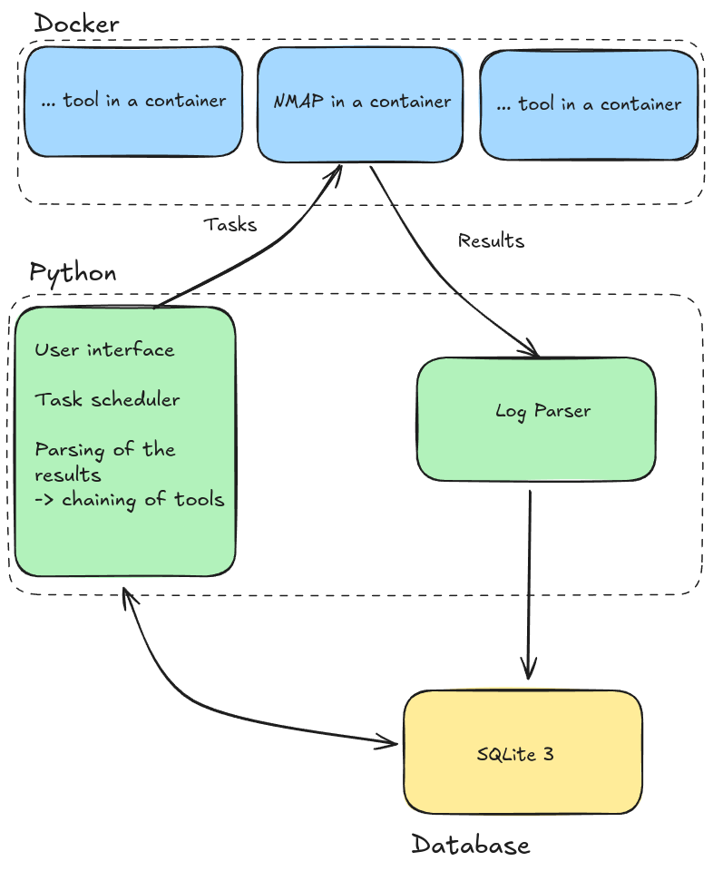
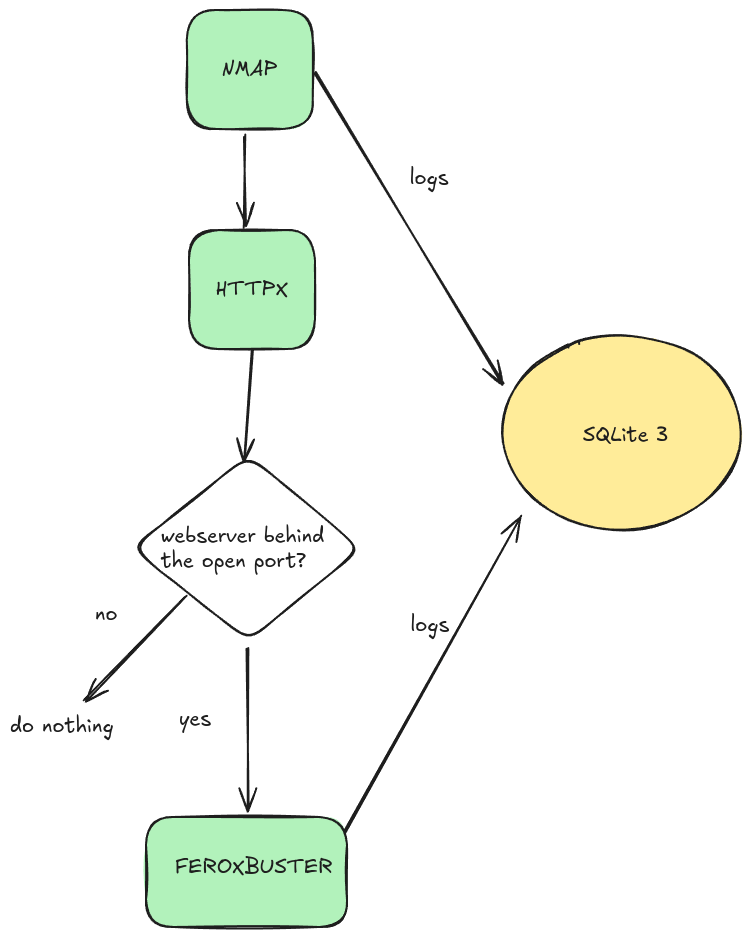

# Tech Demo: Programmatic Vulnerability Scanning & Management
Showcasing a system to automate the running of vulnerability & testing tools, and storing their results into a database for easier access, analysis & integration.


## Overview
This is a demo showcasing an automated approach to programmatic running & storing of vulnerability scanner results. Results are stored into a database for easier access, future data-analysis, and to allow chaining of tools. The aim of this solution is to facilitate efficient scanning, tracking, and management of vulnerabilities across multiple tools & methdos.

> ⚠️ Remember that the tools are being run on your server! You, and you only are responsible for any misuse of this software.

# Usage

This software isn't really meant to be run as a complete solution as is, but rather show a way of building a Python wrapper of sorts to tooling. To run & tinker with the demo, install the following and run + tinker with `main.py`

You need the following software:
```
git
docker
python3
```

Git clone this repository:
```bash
git clone https://github.com/Vsimpro/pvsm
```

You need to install the following dependencies to run the code: 
```bash
cd pvsm
pip install -r requirements.txt
```

Run using:
```
python3 main.py -t <TARGET_IP>
```

## Further explanation & thoughts.

The goal is to offer a better 'framework', 'system', or a 'library' for automation of cybersecurity tooling, than just using simple bash & powershell. While using aformentioned scripts & storing inputs and outputs into folders & files can be simple & easy, in the long run creating complex automation and/or chains of tooling this way can get messy and worksome. 

Installing & maintaining the tools and system needed can be tackled with Docker, where only a few key dependencies have to be installed to run all the needed tools on all the needed machines. 

This project is a Demo of this idea. The structure is as follows:



The basic idea is to run the tools inside a docker container, parse the output, and store them into a database. Each tool has an Object, such as `class Nmap:` which represents one run/output of the scan. It's member functions are used to run, parse, and handle the data coming in and out, and it must include the required SQL queries to maintain the database.

## Demo

One toolchain demoed here is a port scan -> content enumeration tool. First we must scan the host/target for with Nmap to find open ports, then determine which are populated by a webserver, and do content discovery on those.

The flow of information would look a bit like this.



See main.py to see how the architechture is used in this demo to achieve this flow!
